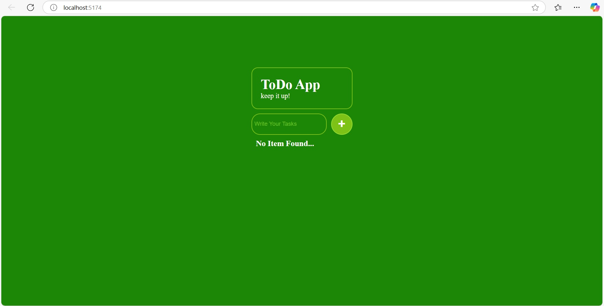
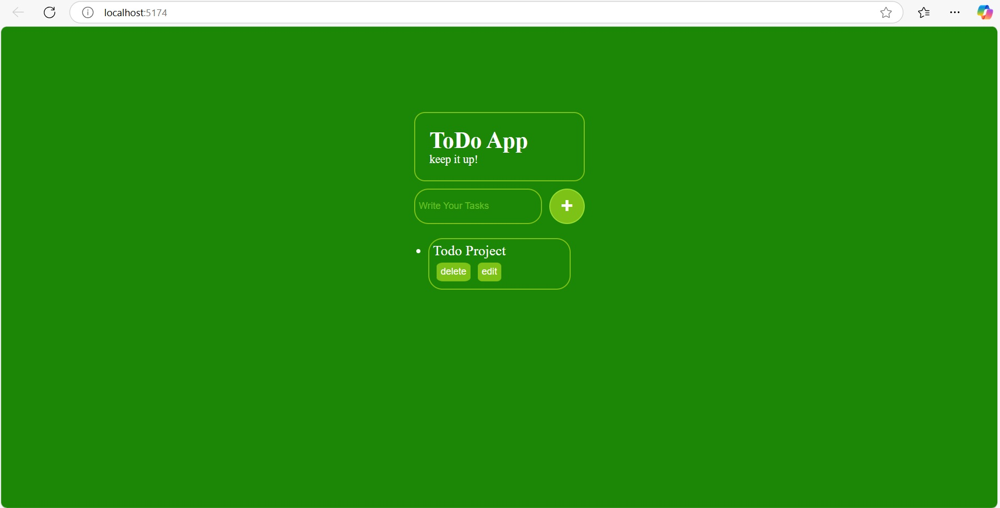

# 📝 ToDo App

A simple and interactive ToDo App built with **React.js** and **Vite**. Users can add, delete, and edit their daily tasks. The app features a clean UI, responsive layout, and intuitive user interactions.

## 🚀 Features

- Add new to-do tasks
- Edit existing tasks
- Delete tasks
- Instant updates using React's state
- Styled using custom CSS
- Uses `useRef` for input management

## 🛠️ Tech Stack

- ⚛️ React.js (via Vite)
- 🎨 CSS (Custom Styling)
- 💡 JavaScript (ES6+)

## 📁 Project Structure

```
todo-app/
├── public/
├── src/
│   ├── App.jsx         # Main component
│   ├── App.css         # Stylesheet
│   └── main.jsx        # Entry point
├── index.html
├── package.json
└── README.md
```

## 🖥️ Screenshots

--- 


## 📦 Installation & Setup

### 1. Clone the repository

```bash
git clone https://github.com/asharaam1/02-ToDo-App.git
cd 02-ToDo-App
```

### 2. Install dependencies

```bash
npm install
```

### 3. Run the app locally

```bash
npm run dev
```

> The app will open at `http://localhost:5173/` (default Vite port).

## ✍️ Code Highlights

- **State Management:** `useState` is used to manage the to-do list.
- **DOM Manipulation:** `useRef` is used to capture the input value.
- **Optimized Re-rendering:** Spread operator (`...todos`) ensures clean state updates.

## 🔧 Future Improvements

- Add task status (completed/pending)
- LocalStorage or Firebase integration
- Add animations with libraries like Framer Motion
- Responsive mobile-friendly design enhancements

---

**Author:**  Asha Ram

🌟 _Feel free to fork and customize! Contributions are welcome!_
